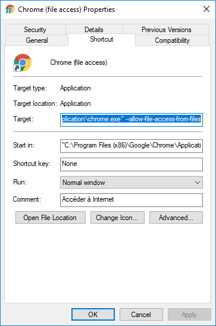
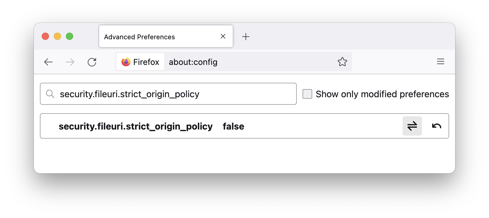

# How to enable local file access on your browser

## Chrome

⚠️ Important ⚠️
For these commands to work, all the Chrome windows should be closed beforehand.

### Linux

From a terminal:

```bash
google-chrome --allow-file-access-from-files index.html
```

### macOS

From a terminal:

```bash
open -a "Google Chrome" index.html --args --allow-file-access-from-files
```

Note that `index.html` must be before `--args`.

### Windows

#### Method 1

1. Create a copy of the Chrome shortcut on your desktop and rename it
   to something like `Chrome (file access)`.
2. Right-click on the shortcut and choose `Properties`.
3. Edit the `Target` field by adding `--allow-file-access-from-files`
   after the double quotes (`"`).
4. Close all the Chrome windows and start Chrome through this new shortcut.
5. Now you can double-click the `index.html` file.



Note that you can safely remove this desktop shortcut after the end of this
class.

#### Method 2

1. Close all Chrome windows.
2. Press Win + R on your keyboard to open the Run dialog box.
3. Enter the command `chrome.exe --allow-file-access-from-files`
4. Now you can double-click the `index.html` file.

## Firefox

⚠️ Important ⚠️
For security reasons, you might want to revert this change after the end of
this class.

1. Type "about:config" in the search bar
2. If necessary, click on "Accept the Risk and Continue"
3. Search for "security.fileuri.strict\_origin\_policy"
4. Double click on `true` to set this parameter to `false`



## Safari

⚠️ Important ⚠️
For security reasons, you might want to revert this change after the end of
this class.

1. Enable the hidden Develop menu through system preferences


1. Disable Local File Restrictions


## Edge

### Windows

1. Press Win + R on your keyboard to open the Run dialog box.
2. Enter the command `taskkill /F /IM msedge.exe` (this will close all the
   open Edge windows)
3. Press again Win + R to reopen the Run dialog box.
4. Enter the command `msedge.exe --allow-file-access-from-files`
5. Now you can double-click the `index.html` file.

### macOS

From a terminal:

```bash
open -a "Microsoft Edge" index.html --args --allow-file-access-from-files
```

Note that `index.html` must be before `--args`.
